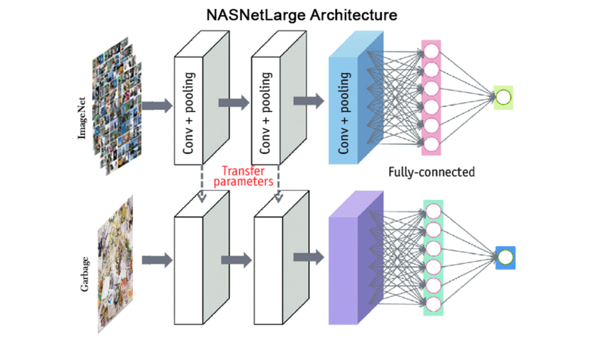
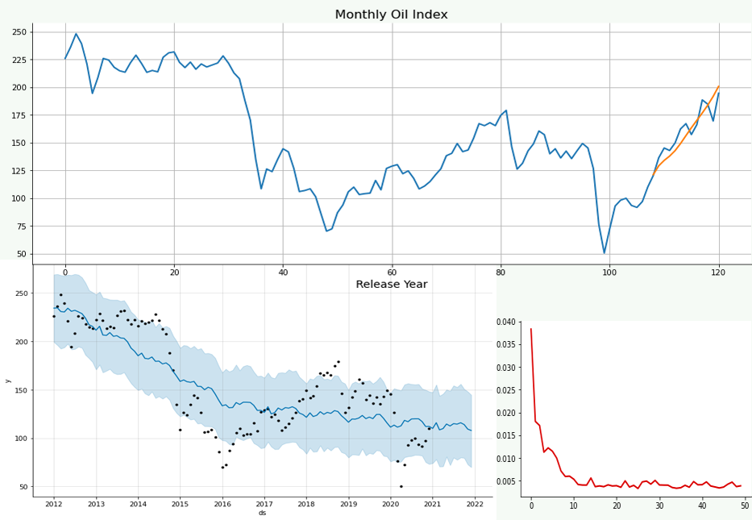

# Portfolio
---
## Recommender Systems

The project explores and compares the following algorithms and approaches for recommending movies.

- Cosine User-User Similarity
- Matrix Factorization
- Deep Neural Network Learning with Keras
- Autoencoders (AutoRec)
- Residual Learning

<video width="640" height="360" controls>
  <source src="video\AmirFakhim.mp4" type="video/mp4">
</video>

---
## Garbage Classification using NASNetLarge fine-tunning

 

The Project presents a model that classifies waste into the following groups: cardboard, glass, metal, paper, plastic, and trash.
This model presents a system for classifying garbage, using convolutional neural networks (modified NASNetLarge structure) and trained with only about 2500 data and test accuracy of 96.5%.

---
## Time series Analysis _ Oil Index

 

First I build co-occurence matrices of ingredients from Facebook posts from 2011 to 2015. Then, to identify interesting and rare ingredient combinations that occur more than by chance, I calculate Lift and PPMI metrics. Lastly, I plot time-series data of identified trends to validate my findings. Interesting food trends have emerged from this analysis.

 

 

---

